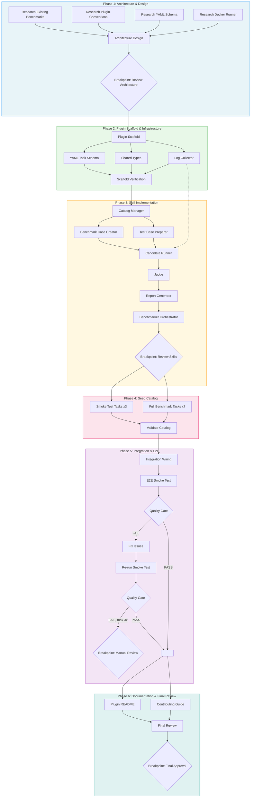

# Obedience Benchmark Plugin — Process Diagram

## Parallel Execution Map

| Phase | Parallel Groups | Sequential Dependencies |
|-------|----------------|------------------------|
| 1 | R1, R2, R3, R4 (all parallel) | All research -> Architecture Design |
| 2 | YAML Schema, Shared Types, Log Collector (parallel) | Scaffold -> parallel group -> Verification |
| 3 | Case Creator + Test Preparer (parallel) | Catalog Mgr -> parallel -> Runner -> Judge -> Report -> Benchmarker |
| 4 | Smoke Tests + Full Tasks (parallel) | Both -> Validate |
| 5 | - | Wiring -> E2E -> Quality Gate (-> fix loop if needed) |
| 6 | README + Contributing (parallel) | Both -> Final Review |

## Breakpoints (4 total)

1. **Architecture Review** — after Phase 1, before implementation begins
2. **Skills Review** — after all 7 skills built, before seeding catalog
3. **Quality Gate Failure** — only if fix loop exhausts 3 iterations
4. **Final Approval** — before marking the run complete
